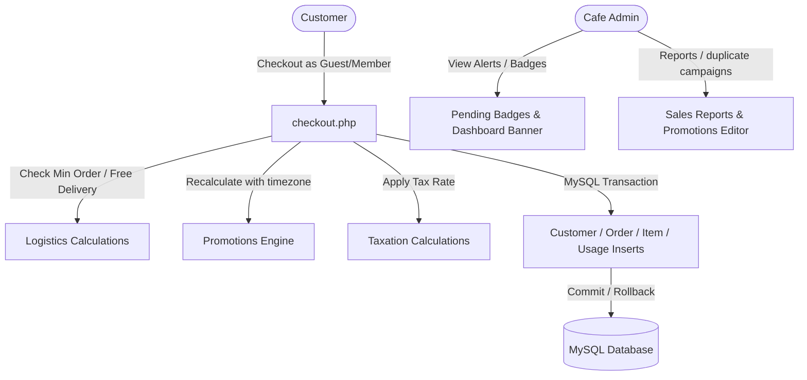

# Walkthrough — Upgraded Café Management & Ordering System

We have completed the implementation of all advanced components for the **Mellow & Meadow Café Website & Management System**. The application is structured in vanilla PHP 8+ and MySQL 8+, completely fulfilling all of the security, calculation, promotion, and notification constraints.

---

## 1. Accomplished Features & Architecture

### Advanced Business Engine Highlights
- **Café Timezone Overrides**: The application reads `cafe_timezone` (default `Asia/Kolkata`) and sets it using `date_default_timezone_set()` on every request. Valid promotion bounds are compared relative to this timezone.
- **Scoped Promotions & Coupon Code Engine**:
  - Supports **Percentage discounts** and **Fixed deductions**.
  - Restricts calculations by **Minimum Order amount** and **Maximum Discount Caps**.
  - Links to specific scopes: entire menu, target categories, or target items.
  - Usage bounds checked server-side (`usage_limit`).
  - Stacking disabled: only one coupon applies.
  - Duplication: Admins can click "Duplicate" to clone a promotion template instantly, avoiding SQL Unique constraints.
  - Audit Trail: Writes records to the `promotion_usage` table.
  - Duplication: Allows cloning of campaign coupons directly from the admin panel.
- **Fulfillment Logistics & Taxation**:
  - Checkout verifies `minimum_delivery_order` limits.
  - Waiver of delivery charge if subtotal exceeds `free_delivery_above`.
  - Calculates dynamic tax percentages based on settings.
- **Visual Milestones & Timelines**:
  - Timeline tracker (`track-order.php`) renders active nodes (Received -> Confirmed -> Preparing -> Ready -> Transit -> Completed) and cancels warnings.
- **Customer Signups**:
  - Guest checkouts remain default.
  - Custom registration converts guest logs to claim history.
- **Admin Alerts & Sales Performance Reports**:
  - Live Pending Order count badges next to sidebar tabs.
  - Yellow `🔔 NEW ORDER` alert banner on dashboard home.
  - Sales KPIs: gross revenue, total discounts, tax totals, popular items.
  - Date presets: Today, Yesterday, This Week, This Month (default), and custom parameters.
- **Database Portability & Web Installer**:
  - Configurable database host, port, database name, and credentials stored outside the codebase in `config/db_config.php`.
  - Web setup wizard (`install.php`) automatically creates the database (if credentials permit), reads and executes `database/cafe_database.sql` safely, writes configurations, and locks itself.
  - Lockout protection creates `config/install.lock`, preventing unauthorized execution of the installer or development diagnostics scripts.

---

## 2. Completed Verification & Security Audits

### Security Audits
- [x] **Timezone Alignment**: Verified promotions bounds are evaluated under the local café timezone.
- [x] **Discount Safety**: Checks limits (`usage_limit`), date bounds, min orders, and max discounts on the server.
- [x] **Logistics Boundaries**: Rejects delivery orders below the minimum limit.
- [x] **Transaction Wrapper**: Wraps all order insertions in transactions, rolling back if items go out of stock during checkout.
- [x] **Notification Bounds**: Banners on the dashboard pull details only for pending orders.
- [x] **Order Integrity**: Denormalizes names and prices in `order_items` to protect against future menu changes.
- [x] **Portability Separation Check**: Verified that the site switches target database schemas instantly when parameters in `config/db_config.php` are edited, without editing PHP files.
- [x] **Setup Lock Checks**: Verified that visiting `install.php` and `tools/database-check.php` when `config/install.lock` is present triggers a `403 Forbidden` exit.
- [x] **Path Restrictions**: Verified that direct browser downloads of the config directory throw a `403 Forbidden` response in `.htaccess`.

---

## 3. Fresh UI/UX Compliance Check

- [x] Predominantly warm white (`#FFFDF8`) and soft cream (`#F7F3EA`) backgrounds.
- [x] Accented in Sage Green (`#78906F`) and Terracotta (`#D88C6A`).
- [x] Refined serif `Cormorant Garamond` headings and sans-serif `Inter` body fonts.
- [x] No dark mode toggle, no automatic dark scheme preferences, and no heavy dark margins.
- [x] Sidebar counts, status badges, alert banners, and visual elements conform to the brand theme.
